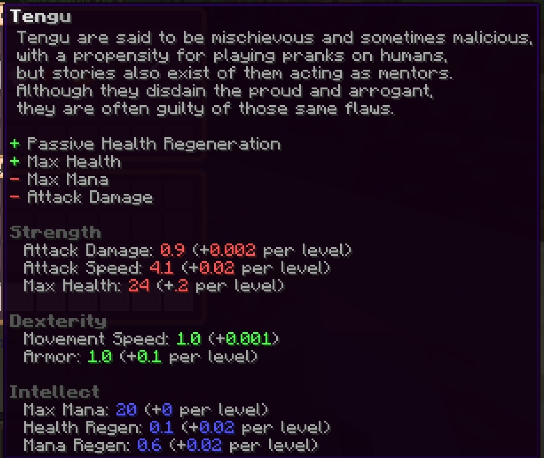
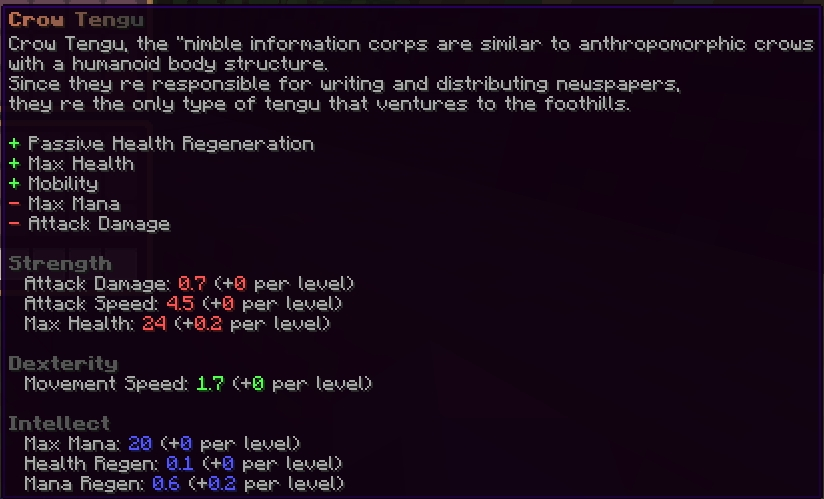
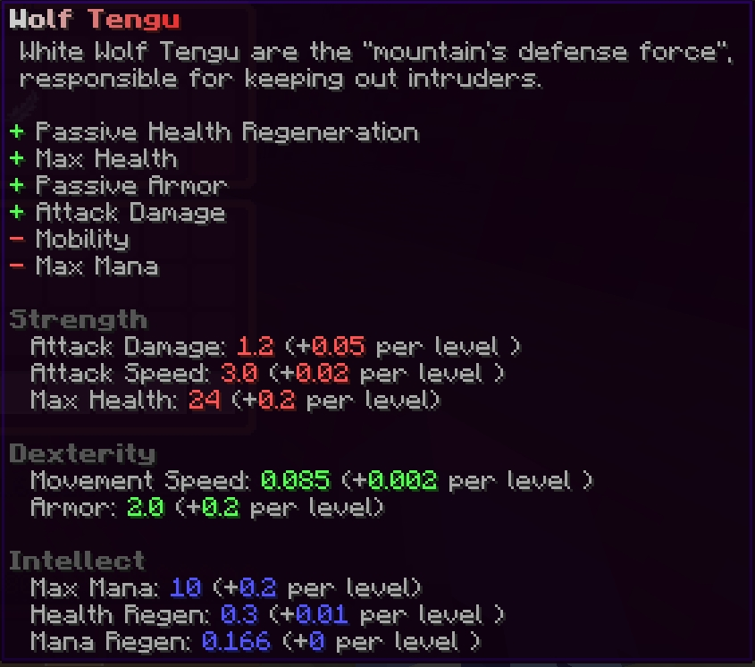

# ✨ Nos aspects

## Météo et épisodes saisonnaux personalisés

Nous avons un système de météo très flexible et optimisé et les épisodes saisonnaux impliquent des températures auquelles vous devrez vous adapter afin de rendre le mode survie un peu plus attrayant.

<figure><figcaption>
Hiver et Printemps
</figcaption></figure>

## Monde en profondeur sans limites

Nous savons tous que Gensokyo est un lieu plein de verticalité. Avec cette fonctionalitée on peut ajouter un nombre illimité de sections à un monde qui vous téléporte et assure une synchronisation! (ça synchronise aussi les wagons)


Demo de cette fonctionalitée en action


## Pêche personalisée

C'est assez explicite mais avec ce plugin il y plus de 20 espèces de poissons à attraper et vendre!&#x20;

<figure><figcaption>
Mini jeu de pêche
</figcaption></figure>

<figure><figcaption>
Vente des poissons
</figcaption></figure>

## Classes personalisées

Vous pouvez choisir votre classe en accord avec les différentes races présentes dans Touhou!

<figure><figcaption>
La classe Tengu
</figcaption></figure>

<figure><figcaption>
Les sous classes Tengu
</figcaption></figure>

 

<figure><figcaption></figcaption></figure>

## Cultures personalisées

Il y a 10 cultures personalisées mais aussi un système d'irragation et les cultures sont également affectées par les saisons!

<figure><figcaption>
Cultures, arroseurs et épouvantail !
</figcaption></figure>

